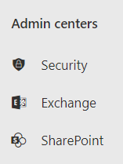
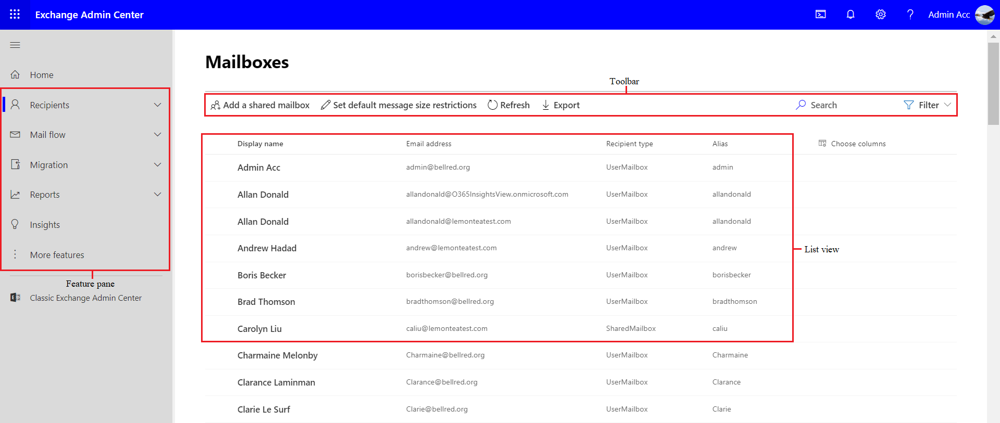
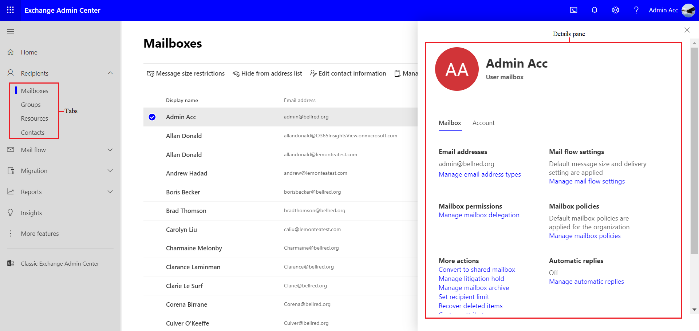

# Exchange admin center in Exchange Online

You use the Exchange admin center to manage email settings for your organization.

## Get to the New Exchange admin center 

You must have [Microsoft 365 admin permissions](https://docs.microsoft.com/microsoft-365/admin/add-users/assign-admin-roles) to access the New Exchange admin center. For more information, see [Permissions in Exchange Online](permissions-exo/permissions-exo.md).

1. [Sign in](https://support.microsoft.com/office/e9eb7d51-5430-4929-91ab-6157c5a050b4) to Microsoft 365 or Office 365 using your work or school account, and then choose the **Admin** tile.

2. In the Microsoft 365 admin center, choose **Admin centers** \> **Exchange**.

    

You can also get to the New Exchange admin center directly by using the URL [https://admin.exchange.microsoft.com](https://admin.exchange.microsoft.com) and sign in using your  credentials.

> [!NOTE]
>Be sure to use a private browsing session (not a regular session) to access the Exchange admin center using the direct URL. This will prevent the credential that you are currently logged on with from being used. To open an InPrivate Browsing session in Microsoft Edge or an incognito window in Google Chrome, press CTRL+SHIFT+N. To open an InPrivate Browsing session in Microsoft Edge Legacy, Internet Explorer, or a Private Browsing session in Mozilla Firefox, press CTRL+SHIFT+P.

## New Exchange admin center features

Here's what the New Exchange admin center looks like.

### Feature pane

Here are the features you'll find in the left-hand navigation.

|**Area**|**What you do here**|
|:-----|:-----|
|**Recipients**|View and manage your mailboxes (both user and shared mailboxes), groups, resource mailboxes, and contacts.|
|**Mail flow**|Manage remote domains, accepted domains, connectors, message tracing, alerts, and alert policies.|
|**Migration**|Migrate mailboxes in batches.|
|**Reports**|View reports on mail flow and migrated batches.|
|**Insights**|Use the recommendations to discover trends and/or insights,  and take actions to fix issues related to mailbox and mail flow.|
|**More features**|Access features and services from the classic exchange admin center.|

### Tabs

The tabs are your second level of navigation. Each of the feature areas contains various tabs, each representing a complete feature.

### Toolbar

When you click most tabs, you'll see a toolbar. The toolbar has icons that perform a specific action.

### List view

When you select a tab, in most cases you'll see a list view. The list view in New Exchange admin center is designed to remove limitations that existed in Exchange Control Panel in the Classic Exchange admin center.

### Details pane

When you select an item from the list view, information about that object is displayed in the details pane.

### Centers, Me tile, and Help

The Centers tile allows you to change from one admin center to another. The Me tile allows you to sign out of the EAC and sign in as a different user. The Help bubble displays contextual help for fields when you create or edit an object.

## Get to the Classic Exchange admin center

You must have [Microsoft 365 admin permissions](https://docs.microsoft.com/microsoft-365/admin/add-users/assign-admin-roles) to access the Classic Exchange admin center. For more information, see [Permissions in Exchange Online](permissions-exo/permissions-exo.md).

1. [Sign in](https://support.microsoft.com/office/e9eb7d51-5430-4929-91ab-6157c5a050b4) to Microsoft 365 or Office 365 using your work or school account, and then choose the **Admin** tile.

2. In the Microsoft 365 admin center, choose **Admin centers** \> **Exchange**.

    

You can also get to the Classic Exchange admin center directly by using a URL. To do this, go to [https://outlook.office365.com/ecp](https://outlook.office365.com/ecp) and sign in using your credentials.

> [!NOTE]
> Be sure to use a private browsing session (not a regular session) to access the Exchange admin center using the direct URL. This will prevent the credential that you are currently logged on with from being used. To open an InPrivate Browsing session in Microsoft Edge or an incognito window in Google Chrome, press CTRL+SHIFT+N. To open an InPrivate Browsing session in Microsoft Edge Legacy, Internet Explorer, or a Private Browsing session in Mozilla Firefox, press CTRL+SHIFT+P.

## Classic Exchange admin center features

Here's what the Classic Exchange admin center looks like.

### Feature pane

Here are the features you'll find in the left-hand navigation.

|**Area**|**What you do here**|
|:-----|:-----|
|**Dashboard**|An overview of the admin center.|
|**Recipients**|View and manage your mailboxes, groups, resource mailboxes, contacts, shared mailboxes, and mailbox migrations.|
|**Permissions**|Manage administrator roles, user roles, and Outlook on the web (formerly known as Outlook Web App) policies.|
|**Compliance management**|Manage In-Place eDiscovery & Hold, auditing, data loss prevention (DLP), retention policies, retention tags, and journal rules.|
|**Organization**|Manage organization sharing and apps for Outlook.|
|**Protection**|Manage malware filters, connection filters, content filters, outbound spam, and quarantine for your organization.|
|**Mail flow**|Manage rules, message tracing, accepted domains, remote domains, and connectors.|
|**Mobile**|Manage the mobile devices that you allow to connect to your organization. You can manage mobile device access and mobile device mailbox policies.|
|**Public folders**|Manage public folders and public folder mailboxes.|
|**Unified messaging**|Manage Unified Messaging (UM) dial plans and UM IP gateways.|

### Tabs

The tabs are your second level of navigation. Each of the feature areas contains various tabs, each representing a complete feature.

### Toolbar

When you click most tabs, you'll see a toolbar. The toolbar has icons that perform a specific action.

### List view

When you select a tab, in most cases you'll see a list view. The list view in Classic Exchange admin center is designed to remove limitations that existed in Exchange Control Panel.

In Exchange Online, the viewable limit from within the Classic Exchange admin center list view is approximately 10,000 objects. In addition, paging is included so you can page to the results. In the **Recipients** list view, you can also configure page size and export the data to a CSV file.

### Details pane

When you select an item from the list view, information about that object is displayed in the details pane.

 **To bulk edit several items**: press the CTRL key, select the objects you want to bulk edit, and use the options in the details pane.

### Centers, Me tile, and Help

The Centers tile allows you to change from one admin center to another. The Me tile allows you to sign out of the EAC and sign in as a different user. From the Help  drop-down menu, you can perform the following actions:

- **Help**: Click  to view the online help content.

- **Disable Help bubble**: The Help bubble displays contextual help for fields when you create or edit an object. You can turn off the Help bubble or turn it on if it has been disabled.

## Supported browsers

See the following articles:

- [Microsoft 365 and Office resources](https://www.microsoft.com/microsoft-365/microsoft-365-and-office-resources): lists supported browsers for Microsoft 365, Office 365, and the Exchange admin center.

- [Supported Browsers for Outlook on the web](https://support.microsoft.com/office/c89774d6-0722-4c93-a547-ef45e693e006).

## Related articles

Are you using Exchange Server? See [Exchange admin center in Exchange Server](https://docs.microsoft.com/exchange/architecture/client-access/exchange-admin-center).

Are you using Exchange Online Protection? See [Exchange admin center in Exchange Online Protection](https://docs.microsoft.com/microsoft-365/security/office-365-security/exchange-admin-center-in-exchange-online-protection-eop).
